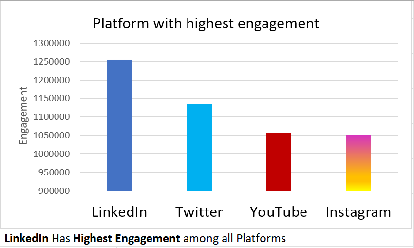
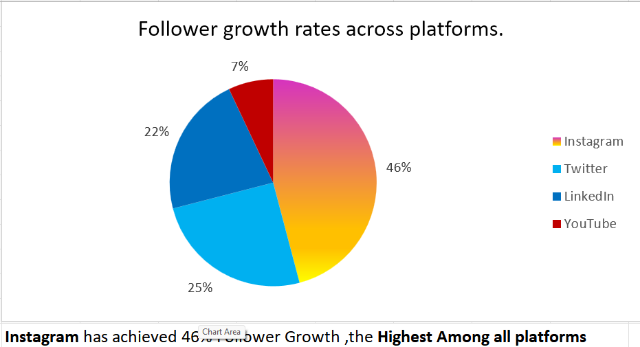

# Hi there, I'm Siddhesh Dandekar
### Data Analyst | Translating Data into Decisions

---

## Apple Social Media Marketing Analysis

This repository contains a comprehensive analysis of Apple's social media performance across four major platforms. The goal wasn't just to look at numbers, but to uncover the story behind which campaigns and platforms truly create value.

###  The Business Problem

A company as large as Apple needs to know where its marketing dollars are best spent. I framed this project around answering three key business questions:

1.  **The Platform Question:** Which social media platform (LinkedIn, Twitter, Instagram, or YouTube) delivers the highest engagement and follower growth?
2.  **The Content Question:** What type of marketing campaign resonates most with the audience and drives new follower acquisition?
3.  **The ROI Question:** Is there a clear correlation between ad spend and follower growth, and which campaign was the most cost-effective?

---

###  My Toolkit & Methodology

I used **Advanced Excel** and **Power Query** to perform this end-to-end analysis.

1.  **Data Cleaning (Power Query):** First, I automated the cleaning process to handle null values, remove duplicates, and standardize data formats across the dataset.
2.  **Feature Engineering:** I created new, valuable metrics like `Engagement Rate` and `ROI` using calculated fields in Pivot Tables.
3.  **In-Depth Analysis:** Using `SUMIFS` and Pivot Tables, I compared "Before vs. During" campaign metrics to calculate the real **Engagement Uplift**.

---

### Key Insights & Discoveries

My analysis revealed three actionable insights that could help shape Apple's future marketing strategy:

* **LinkedIn is the Engagement King:** While Instagram showed a higher growth rate, **LinkedIn** delivered the highest raw engagement, making it the ideal platform for professional brand announcements.

* **Purpose-Driven Content Wins:** The **"Sustainability Awareness Drive"** was the #1 campaign for attracting new followers, gaining over **107,000 followers** and proving that brand values matter.

* **The Most Efficient Campaign:** The **Apple Watch Ultra 2 Launch** was identified as the most cost-effective campaign, delivering the highest ROI for every dollar spent on advertising.

---

### Inside this Repository

*   `Excel project.xlsx`: The complete Excel file with all data, Power Query steps, and Pivot Table analysis.
*   `Approach Sheet.docx`: A detailed, step-by-step document explaining my entire thought process and technical execution.
*   `/Visualizations`: A folder containing screenshots of the key charts and dashboards from the analysis. *(Pro-tip: Create this folder and add your screenshots!)*

### Let's Connect!

Thank you for checking out my project! I'm always open to connecting with fellow data enthusiasts and learning from others in the field.

*   **LinkedIn:** www.linkedin.com/in/siddheshdandekar

